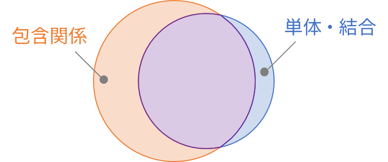

# 包含関係と従来の単体・結合関係の関係性を調べる
2種類の調査を行う：
1. 包含関係ならば単体・結合関係か？
2. 単体・結合関係ならば包含関係か？

予想は下の図である、すなわち：
- 包含は単体・結合よりも細かく、多くの単体・結合を表現する。  
- しかし、多くが過剰な表現である。  
- また、一部の単体・結合の関係は包含で検出できない。

# 準備
## 単体・結合の定義
ここで、調査のための単体・結合の定義を3種類述べる。  
Trautschらの解釈および定義を参考にした：
- [Are There Any Unit Tests? An Empirical Study on Unit Testing in Open Source Python Projects](https://ieeexplore.ieee.org/document/7927976)
- [Are unit and integration test definitions still valid for modern Java projects? An empirical study on open-source projects](https://www.sciencedirect.com/science/article/pii/S0164121219301955)

### ISTQBの定義
- 単体テスト＝1つのクラスのみを検証するテスト
- 結合テスト＝上記以外

### IEEEの定義
- 単体テスト＝1つのパッケージのみを検証するテスト
- 結合テスト＝上記以外

### 開発者（DEV）の定義
- 単体テスト＝テストパスの中に結合であることを明示するキーワードが含まれていなく、かつ所属するテストクラスと１対１に対応するプロダクトクラスが存在するテスト
- 結合テスト＝上記以外

## 対象OSS
- [jsoup](https://github.com/jhy/jsoup)
- [Gson](https://github.com/google/gson)

## 評価指標
単体テストに着目する。  
つまり、包含レベルが $k$ 未満であるテストケースを単体テストとみなし、適合率と再現率を算出する。  
$$
\mathrm{適合率} = \dfrac{TP}{TP+FP},\quad \mathrm{再現率} = \dfrac{TP}{TP+FN}
$$
ここで $TP,FP,FN$ は以下の表に該当する数である：

||  単体テストである  |  結合テストである  |  
| ----: | :----: | :----: |  
| 包含レベルが $k$ 未満 |  TP  |  FP  |  
| 包含レベルが $k$ 以上 |  FN  |  TN  |

すなわち、
- 適合率＝包含による単体・結合判定の誤検出のなさ
- 再現率＝包含による単体・結合判定の取りこぼしのなさ

# 結果

TODOリスト
- [x] テストケース分類器を作成
- [ ] テストケースの包含レベルを付与するスクリプトを作成
- [ ] 評価指標を計算するスクリプトを作成